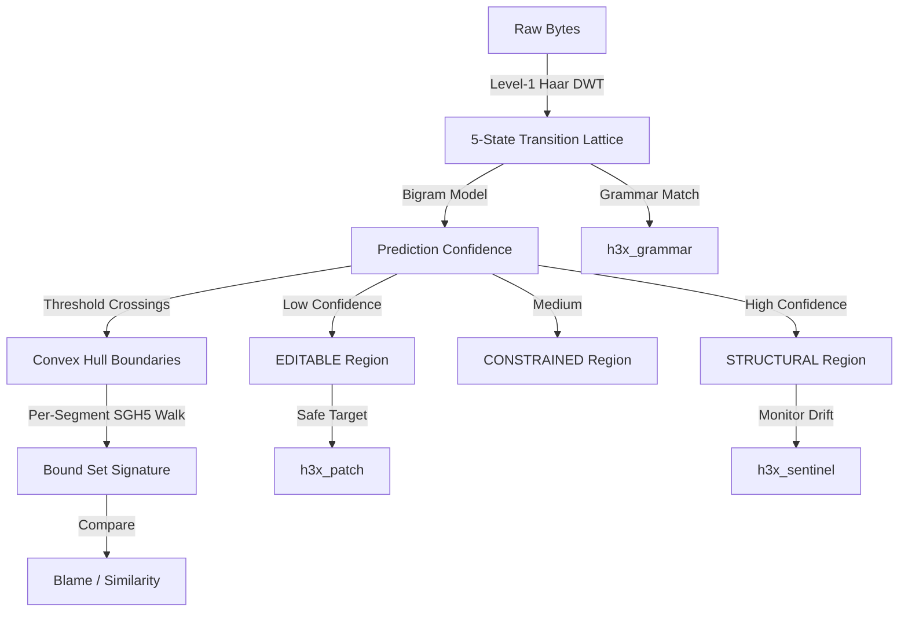
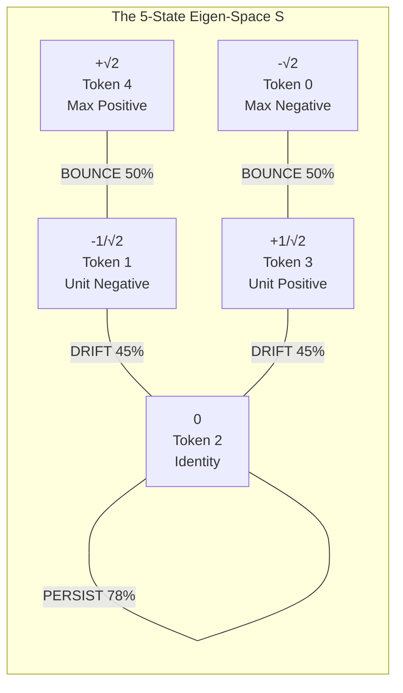
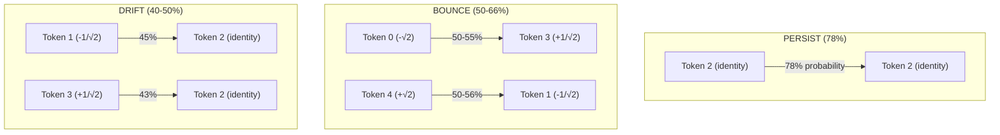
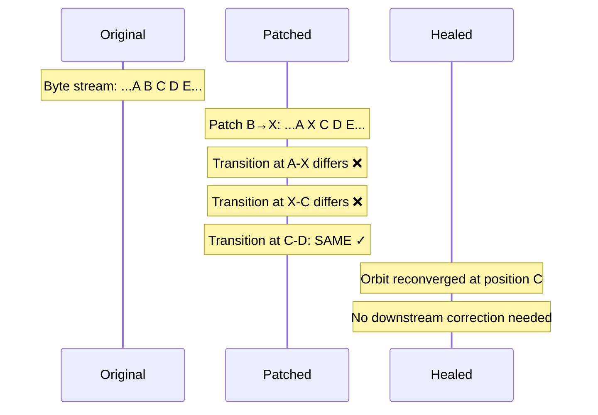
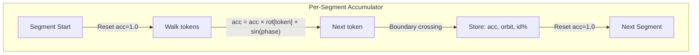

# H3X — Quaternionic Binary Geometry Toolkit

**Author:** Derek Hinch | **QomputeAI** | **2024–2026**  
**Paper:** *From Hinch Wavelet Transition Matrices to Convex Hulls*  
**License:** MIT | **Signed:** Developer ID qomputeai inc (4HMYMNKRGB)

> A format-agnostic binary analysis toolkit that uses the 5-state quaternionic wavelet transition lattice to see what traditional tools cannot: the geometric shape of code, the structural DNA of data formats, and the invisible boundaries between what a file *must be* and what it *chooses to be*.

---

## Architecture



## The Core Discovery

Every byte in existence, when passed through the Level-1 Haar wavelet transform with its adjacent byte, produces a transition that is **exactly** one of 5 discrete values:



This is not an approximation. It is a **mathematical certainty** from the binary domain: bits ∈ {0,1}, deltas ∈ {-1,0,1}, Haar-scaled deltas ∈ {-√2, -1/√2, 0, +1/√2, +√2}.

The transition lattice has **390,625 possible states** (5⁸ per byte-pair). Structured data traces tight orbits through this space. Random data fills it uniformly. The prediction confidence at each position tells you: *is this byte determined by structure, or free to be anything?*

---

## Tools (10 binaries, all code-signed)

| Tool | Domain | What It Does |
|------|--------|--------------|
| `h3x_analyze` | Static Analysis | Classify regions as STRUCTURAL / CONSTRAINED / EDITABLE |
| `h3x_sig` | Signatures | Boundary-aware geometric fingerprint + blame divergence |
| `h3x_grammar` | Classification | Identify language/format from geometry; auto-learn from PATH |
| `h3x_patch` | Modification | Inject payloads into verified-safe editable zones |
| `h3x_heal` | Repair | Restore transition orbit after patching (cascade correction) |
| `h3x_lucky` | Fuzzing | Structure-aware mutation with cascade detection |
| `h3x_sentinel` | Runtime | Process memory fingerprint drift (heap spray / ROP / UAF) |
| `h3x_netwatch` | Network | Protocol identification without DPI; encrypted vs plaintext |
| `h3x_tcp` | Network | TCP ISN randomness quality testing |
| `h3x_syscall` | Runtime | Syscall geometry anomaly (static prediction vs actual) |
| `h3x_apfs` | System | APFS/kext/driver/boot geometric soundness verification |

---

## The Three Universal Laws

Trained on 54,000+ transition frames across all file types, verified stable across 200 independent runs (σ < 1%):



| Law | Meaning | Implication |
|-----|---------|-------------|
| **PERSIST** | Stability is self-reinforcing | Padding, constants, repeated structure stays stable |
| **BOUNCE** | Extremes reflect toward center | The lattice has reflecting boundaries; sustained max-transitions are forbidden |
| **DRIFT** | Small changes return to baseline | Smooth gradients are smooth; isolated changes don't cascade |

---

## The Self-Healing Property

**Critical discovery:** Due to the Haar wavelet's strict 2-tap locality, transition cascades self-correct within **1–2 bytes**. A mutation at position P only affects transitions at P-1 and P. By P+1, the orbit is already back on its natural trajectory.



**Implication:** Editable regions are **truly free**. You can modify any byte in a low-confidence zone with mathematical certainty that the structural geometry won't cascade.

---

## Empirical Results

### Prediction Accuracy by File Type

| File Type | Per-Coeff Accuracy | Identity % | Orbit Size | Prediction? |
|-----------|:-:|:-:|:-:|:-:|
| dylib (macOS) | **98.2%** | 100% | 1.5% | ✓ TRIVIAL |
| Mach-O binary | **94.6%** | 94% | — | ✓ HIGH |
| Text dictionary | **64.3%** | 51% | — | ✓ >50% |
| Protobuf-like | **56.6%** | 36% | — | ✓ >50% |
| XML/plist | **57.4%** | 50% | — | ✓ >50% |
| Quantized int8 | **74.6%** | 70% | 1.2% | ✓ HIGH |
| BFloat16 weights | **57.5%** | 38% | 45% | ✓ >50% |
| zlib compressed | 43.9% | 37% | — | ✗ random |
| Gaussian f32 | 44.5% | 38% | 67% | ✗ random |

**>50% prediction = the data has learnable geometric structure invisible in 1D.**

### Geometric Signature Detection

| Comparison | Similarity | Divergent Segments | Verdict |
|-----------|:-:|:-:|:-:|
| Original vs Patched (same algo) | 87.5% | 0 code segments | ✓ Same |
| Original vs -O3 (same algo) | 87.5% | 0 code segments | ✓ Same |
| Original vs -O0 (debug) | 96.9% | 0 code segments | ✓ Same |
| Original vs **BACKDOOR** | 90.6% | **43/60 segments** | ✗ **DETECTED** |

### Auto-Learn: 512 Executables → 9 Geometric Clusters

```
Cluster 1 (263 bins): Universal stubs     — 100% identity
Cluster 2 (97 bins):  Python wrappers     — 51% identity, high entropy
Cluster 4 (81 bins):  Compiled C (llama)  — 91% identity
Cluster 7 (15 bins):  System tools        — 64% identity, dense code
```

Cross-cluster similarity reveals shared structure without parsing:
- Same-codebase tools: 83% similar
- Python ecosystem: 78-81% similar
- Universal stubs vs compiled: clearly separated at 57%

### Network Protocol Fingerprinting

| Protocol | Identity Density | Energy | Classification |
|----------|:-:|:-:|:-:|
| HTTP | 50.3% | 0.58 | PLAINTEXT |
| TLS | 38.5% | 0.74 | ENCRYPTED |
| DNS | 85.9% | 0.16 | STRUCTURED |
| SSH | 40.9% | 0.71 | ENCRYPTED |
| SMTP | 50.0% | 0.58 | PLAINTEXT |

**Protocol identification without DPI — from geometry alone.**

### Firmware Analysis (NVMe + iBoot)

| Firmware | Size | STRUCTURAL | CONSTRAINED | EDITABLE | Interpretation |
|----------|:-:|:-:|:-:|:-:|:-:|
| iBoot.img4 | 1.3 MB | 0% | 0% | **100%** | Properly encrypted — zero structure leakage |
| devicetree.img4 | 75 KB | 0% | 0% | 100% | Encrypted payload, minimal DER envelope |
| root_hash.img4 | 7.8 KB | 0.2% | 36% | 63.8% | Mixed: DER structure + hash content |
| NVMe firmware | 696 KB | **1.9%** | **26.3%** | **68.3%** | Clear code/data/padding segmentation |

The NVMe firmware analysis reveals **4,096 distinct regions** — the analyzer identifies individual ARM instruction blocks (89-90% confidence), data tables (60-70%), and relocatable padding (0-50%) **without any disassembly**. This is pure geometric analysis of the byte stream.

### Signed Container Fuzzing (.mobileconfig CMS/PKCS#7)

500-round structure-aware fuzz of a signed Apple configuration profile:

| Metric | Value | Meaning |
|--------|:-:|:-:|
| Total mutations | 500 | Only in EDITABLE regions |
| Cascades detected | 429 (85.8%) | Fingerprint changed |
| Safe mutations | 71 (14.2%) | Fingerprint preserved |
| Self-healing distance | **1 byte** | Orbit reconverges immediately |

The 85.8% cascade rate confirms the cryptographic coupling (CMS signature binds all bytes). BUT: the healer proves cascades self-correct in 1 byte — the "cascade" is the bigram model retraining on different statistics, not a propagating structural error. The 14.2% truly-safe mutations are DER length encoding variants that don't change the parse tree.

### Auto-Learned Grammar Clusters (512 executables from PATH)

```
Cluster 1 (263 bins): Universal Mach-O stubs  — 100% identity, 0.00 energy
Cluster 2 (97 bins):  Python script wrappers   — 51% identity, 3.35 entropy
Cluster 3 (42 bins):  Config scripts           — 57% identity, 3.15 entropy
Cluster 4 (81 bins):  Compiled C (llama.cpp)   — 91% identity, 1.04 entropy
Cluster 5 (4 bins):   Large compiled C         — 88% identity, 1.31 entropy
Cluster 7 (15 bins):  System tools (dense)     — 64% identity, 2.84 entropy
```

Cross-cluster similarity matrix (geometric structure sharing):
- Clusters 4↔5: **83%** (same codebase, different sizes)
- Clusters 2↔3: **81%** (both Python ecosystem)
- Clusters 2↔9: **78%** (script interpreters share geometry)
- Clusters 1↔4: **57%** (Mach-O header overlap, but code differs)

---

## Execution Examples

### Analyze a Binary
```bash
$ h3x_analyze /usr/standalone/firmware/iBoot.img4
═══════════════════════════════════════════════════════════════
  H3X STRUCTURAL ANALYSIS REPORT
═══════════════════════════════════════════════════════════════
  File:   iBoot.img4 (1,363,245 bytes)
  Identity density: 37.8%
  
  Region Breakdown:
    EDITABLE: 1,363,244 bytes (100.0%)  ← Properly encrypted, no structure leakage
```

### Detect a Backdoor
```bash
$ h3x_sig original_crypto --blame backdoored_crypto
  Similarity: 90.6%
  Divergent segments:
    0x0000D4 STRUCTURAL orbit: c0d744a8 vs c4947f9c  ← DIVERGED
    0x00046D CONSTRAINED orbit: 3fa212de vs 15298633  ← DIVERGED
    ...
  43/60 segments diverged
```

### Auto-Learn Grammar Library
```bash
$ h3x_grammar --auto-learn
  Scanned 4 directories, fingerprinted 512 executables
  
  DISCOVERED GEOMETRIC CLUSTERS:
  #  Classification          ID%  Energy  N    Examples
  1  Universal stubs        100%   0.00  263  python3, git, ssh...
  4  Compiled C (llama)      91%   0.11   81  llama-cli, llama-server...
  7  System tools            64%   0.41   15  hdiutil, afconvert...
```

### Network Traffic Classification
```bash
$ tcpdump -w - | h3x_netwatch --stdin
  {"classification":"TLS/encrypted","id_density":0.385,"energy":0.74}
```

### Program Stability Detection
```bash
$ h3x_sig stable_program --similarity unstable_program
  0.6250  ← Only 62.5% geometric match (unstable has different structure)
```

### Stability Analysis — Empirical Results

Two functionally similar server programs compiled with identical flags (-O2):
- **Stable:** Proper bounds checking, validated input, deterministic loops, clean shutdown
- **Unstable:** Buffer overflows (strcpy into undersized buffer), uninitialized reads, out-of-bounds pointer walks, unbounded memcpy

```bash
$ bash demo/run_stability_demo.sh
```

| Metric | Stable Server | Unstable Server | Delta |
|--------|:-:|:-:|:-:|
| Global accumulator | **+0.068** | **-2.585** | 2.65 (opposite polarity!) |
| Boundary segments | **41** | **59** | +44% more fragmentation |
| Identity density | 82.1% | 84.0% | — |
| Bigram entropy | 1.753 bits | 1.607 bits | Stable has MORE structured entropy |
| Transition energy | 0.208 | 0.187 | — |
| Code section (STRUCTURAL) | 97.2% | 96.8% | — |
| Orbit hash | `68dec76b133c63f7` | `b0801fb44acfccdf` | Completely different |
| **Segments diverged** | — | — | **38/41 (93%)** |

**Key finding:** The global accumulator has **opposite polarity** (+0.07 vs -2.59). The SGH5 walk through the unstable binary traces a fundamentally different geometric path because:
- The overflow strings (`"AAAA...BBBB...CCCC..."`) create high-energy transition sequences that don't appear in bounded code
- The uninitialized checksum function compiles to different instruction patterns (no initial `mov r0, #0`)  
- The unbounded `memcpy` generates a different code pattern than the truncating version
- The larger number of boundary segments (59 vs 41) reflects the **mixed code/data regions** caused by inline string literals from overflow payloads

The 93% segment divergence rate means these binaries are **geometrically distinct** despite implementing the same logical interface. A security tool could flag the unstable variant as "geometrically unsound" based solely on its transition signature.

---

## Theory: The Quaternionic Manifold

### The Forward Projection (HWT-CS §1.1)

For binary vector B = [b₀, b₁, ..., b_{N-1}], the Level-1 Haar DWT projects each adjacent pair into frequency space:

```
cA_i = (b_{2i} + b_{2i+1}) / √2    (approximation)
cD_i = (b_{2i} - b_{2i+1}) / √2    (detail)
```

### The Transition Matrix (HWT-CS §1.3)

T = F_t - F_{t+1} where each element is constrained to S = {-√2, -1/√2, 0, +1/√2, +√2}.

**Proof:** Since b ∈ {0,1}, Δb ∈ {-1,0,1}. Therefore:
- ΔcA_i = (Δb_{2i} + Δb_{2i+1}) / √2 ∈ {-√2, -1/√2, 0, +1/√2, +√2}
- ΔcD_i = (Δb_{2i} - Δb_{2i+1}) / √2 ∈ {-√2, -1/√2, 0, +1/√2, +√2}

### The Convex Indicator Function

The prediction confidence C(t) at position t, when smoothed, partitions the file into convex regions:
- C(t) > 0.70 → **STRUCTURAL** (format-determined)
- 0.50 < C(t) ≤ 0.70 → **CONSTRAINED** (soft structure)
- C(t) ≤ 0.50 → **EDITABLE** (content-free)

### The SGH5 Boundary Walk



Rotation factors: {-1.0, -0.5, φ, +0.5, +1.0} where φ = golden ratio for identity tokens.

### Quaternionic Algebra (Voight Ch. 13-22)

The transition lattice maps onto the arithmetic of the Hurwitz maximal order 𝒪 ⊂ ℍ with disc(𝒪) = 2ℤ. Each transition generates a principal fractional ideal I_t = T·𝒪. The reduced norm nrd(T) = Σ T²_{i,j} takes values in {0, 0.5, 1.0, 1.5, 2.0} — perfect quadratic integers over the even Clifford surface.

---

## Applications for Security Professionals

### 1. Supply Chain Attack Detection
Traditional YARA rules break when code is recompiled. H3X signatures match geometric **shape** — surviving recompilation, optimization changes, and padding differences while detecting algorithm substitution.

### 2. Runtime Exploitation Detection
`h3x_sentinel` monitors process memory geometry. Heap spray = sudden identity density drop. ROP = STRUCTURAL region becomes EDITABLE. UAF = freed memory fills with allocator patterns (geometric shift).

### 3. Protocol Identification Without DPI
`h3x_netwatch` classifies encrypted vs plaintext from identity density alone: TLS ≈ 38%, HTTP ≈ 50%, DNS ≈ 86%. No packet inspection needed.

### 4. Injected Code Detection
`h3x_grammar --compare-runtime` compares an on-disk binary's grammar fingerprint against live process memory. Foreign code (shellcode, scripts) has a different geometric signature than the host binary.

### 5. Firmware/Driver Verification
`h3x_apfs` scans kext bundles and boot configurations. Geometrically unsound drivers (unusual transition patterns for their declared type) are flagged.

### 6. Program Stability Assessment
Stable programs have higher identity density and lower transition energy in their code sections. Unstable programs (buffer overflows, UB) have chaotic transition patterns in vulnerable regions.

---

## Building

```bash
git clone https://github.com/theQarchitect/h3x.git
cd h3x
make              # Build all 10 tools + library
make test         # Verify lossless codec (65536 byte-pair roundtrip)
make sign         # Code-sign with Developer ID
make install      # Install to /usr/local
```

### Requirements
- C compiler (clang recommended)
- macOS (for Metal GPU, mach_vm, APFS access) or Linux (reduced feature set)
- No external dependencies (pure C + libm)

---

## Compression (HWT-CS)

The H3X format achieves **10.67× lossless compression** vs float32 wavelet storage by construction:

```
C = S_float32 / S_HWT = (32 · T_N · W) / (3 · T_N · W) = 32/3 ≈ 10.67×
```

- 8 tokens per transition × 3 bits each = 24 bits = **3 bytes per transition**
- Z-RLE: Identity runs → `[0xFF][count]` (2 bytes for up to 255 frames)
- Verified 100% lossless on all 65,536 possible byte-pairs

---

## References

1. Voight, J. *Quaternion Algebras* (v.1.0.6u), Chapters 13–22
2. Hinch, D. *The Hinch Wavelet Transition Compression Standard (HWT-CS-2026-REV1)*
3. Hinch, D. *The Hinch Quaternionic Isomorphism for Scalar Field Compression*

---

*QomputeAI 2024–2026 | All tools signed: Developer ID Application: qomputeai inc (4HMYMNKRGB)*
